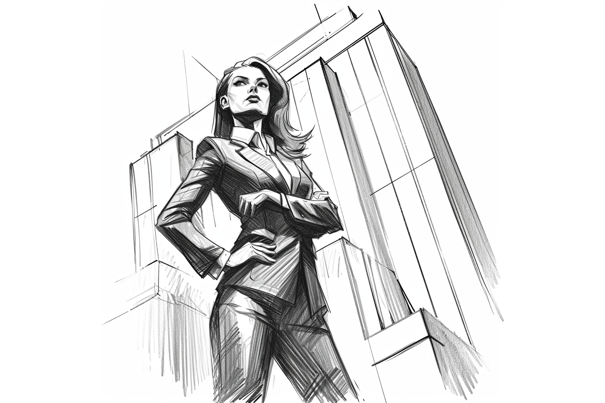

# Din rollperson

Du har friheten att skapa en rollperson som verkligen speglar din fantasi och kreativitet. Här finns inga traditionella gränser för vad din karaktär kan vara. Oavsett kön, bakgrund, eller personlighetstyp, kan din rollperson representera en mängd olika identiteter och egenskaper. Denna öppenhet uppmuntrar till utforskande av olika perspektiv och ger dig möjligheten att gestalta en karaktär som ligger utanför vanliga stereotyper eller begränsningar.

Genom att gestalta en rollperson som är helt skild från dig själv, får du en chans att se världen ur ett helt nytt perspektiv.

**Rollformulär:** Detta är som din karaktärs identitetshandling. Det är här du dokumenterar all viktig information om din rollperson -- från grundläggande detaljer som namn och bakgrund till specifika färdigheter och egenskaper. Tänk på formuläret som en levande dokumentation av din karaktärs resa och utveckling. Under spelets gång kommer du att fylla i och uppdatera detta formulär, vilket hjälper dig att hålla koll på din karaktärs framsteg och förändringar.

## Utseende

Utseendet på din rollperson är mer än bara ett yttre attribut; det är ett uttryck för deras identitet och historik. Det kan spegla deras bakgrund, livsstil, erfarenheter och till och med deras personlighet. När du väljer ditt utseende från vår T20-tabell, tänk på hur dessa fysiska drag kan berika din rollpersons berättelse och hur de uppfattas i spelets värld.

| **T20** | **Utseende**                    | **T20** | **Utseende**                    |
|:-------:|---------------------------------|:-------:|---------------------------------|
| 1       | Skarpa ögon                     | 11      | Vältrimmad skäggstubb           |
| 2       | Ett ärr över kinden             | 12      | Karakteristisk frisyr           |
| 3       | Ovanligt långt hår              | 13      | Atletisk byggnad                |
| 4       | Distinkt tatuering              | 14      | Tunnhårig                       |
| 5       | Imponerande höjd                | 15      | Kraftiga händer                 |
| 6       | Strålande leende                | 16      | Distinkt röst                   |
| 7       | Mycket blek hy                  | 17      | Vacker näsa                     |
| 8       | Hårig                           | 18      | Ovanligt liten statur           |
| 9       | Ovanlig ögonfärg                | 19      | Buskiga ögonbryn                |
| 10      | Naturligt lockigt hår           | 20      | Särskilt anmärkningsvärda öron  |

## Språk

Effektiv kommunikation är central för samarbetet och de dagliga operationerna inom spelvärlden. Språket som talas i varje region av spelets värld underlättar intern kommunikation och samverkan.

### Lokalt

Det lokala språket varierar beroende på spelets geografiska placering. I varje region av "Panoptikons" värld har rollpersonerna kunskap i regionens dominerande språk som en grundläggande del av deras kommunikationsförmåga.

### Externt

Kommunikation med personer utanför din region kräver ofta kunskap i andra språk. Här blir färdigheten **Främmande språk** avgörande för framgångsrik interaktion. Genom att investera poäng i denna färdighet kan din rollperson lära sig ytterligare språk, vilket breddar dess förmåga att kommunicera effektivt i en internationell miljö.

Du kan alltid försöka kommunicera på andra språk genom att göra ett Handlingskast, men detta är osäkert och beror på tur och improvisation.

### Språktabell

Denna tabell representerar en lista över språk i "Panoptikon". Var och en med en unik kulturell och språklig blandning som speglar världens mångfald.

| **Språk**   | **Beskrivning**                                                                 |
|-------------|---------------------------------------------------------------------------------|
| Solantica   | En fusion av de latinska och romanska språken, präglad av poetisk skönhet.      |
| Nordhymia   | Ett robust språk med rötter i vikingarnas kultur, spridit över norra klotet.     |
| Dravidiska  | Djupa rötter i sydligaste delen av världen, fylld av mystik och magiska konster. |
| Meridiane   | En mosaik av afrikanska, arabiska och swahili-influenser, rik på handel och vishet. |
| Paciforia   | Språket av hav och öar, en harmoni av maori, filippinska och andra öspråk.       |
| Aurorasia   | En symfoni av språk från Fjärran Östern, känd för sin sofistikering och visdom. |

